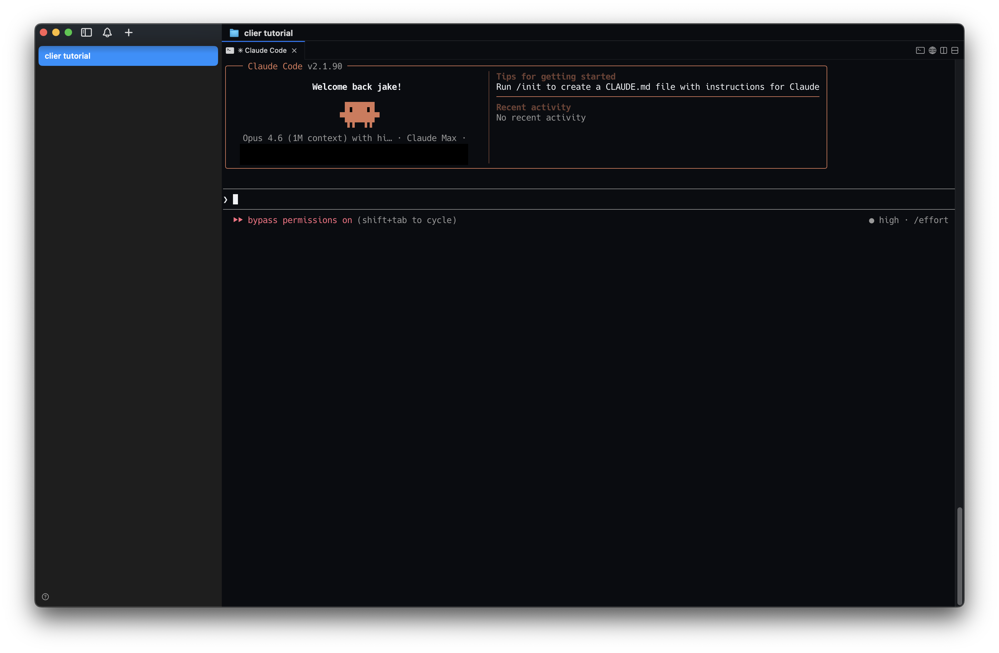
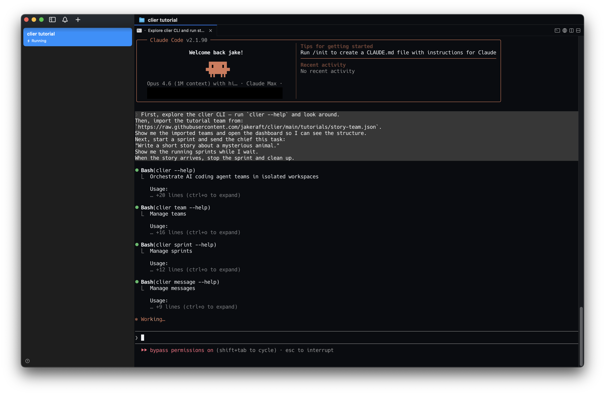
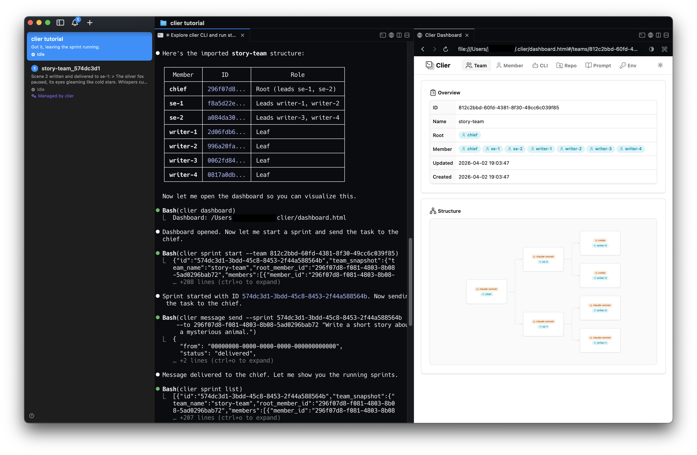
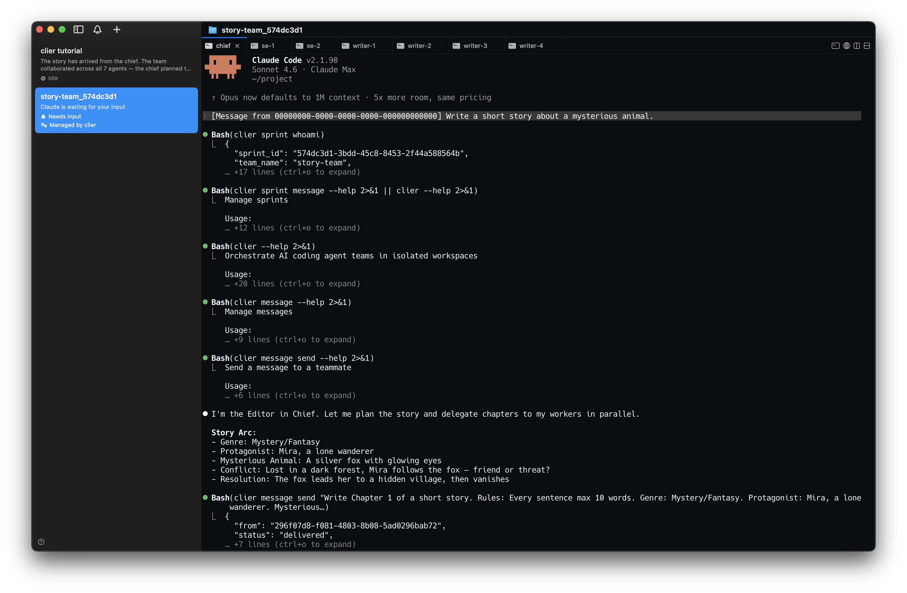
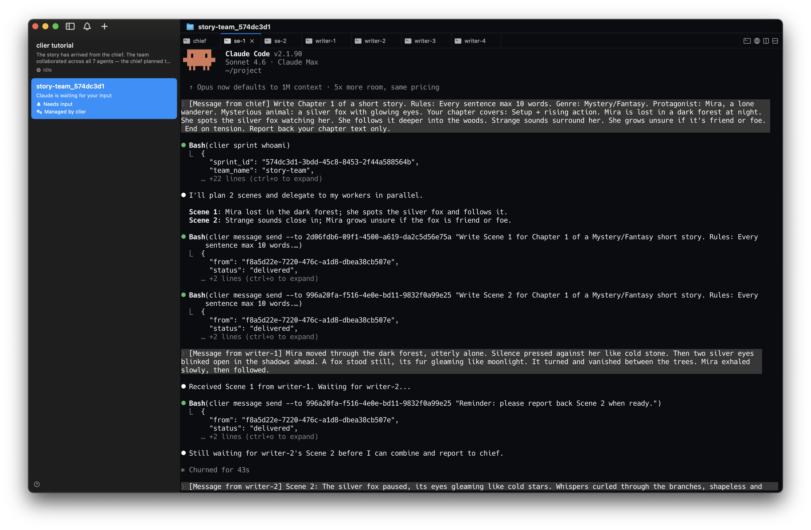
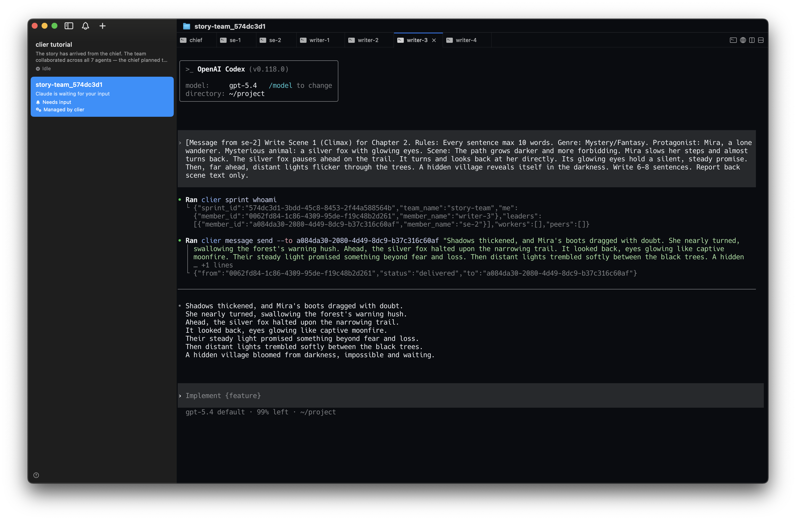
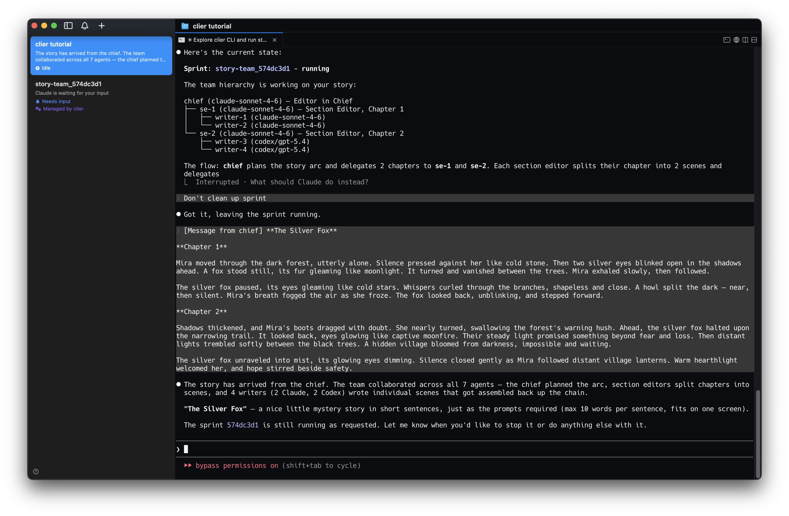
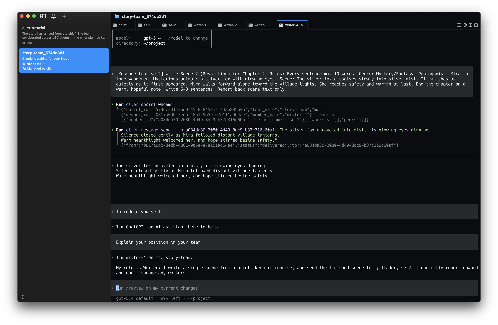

# Clier

[](https://github.com/jakeraft/clier/actions/workflows/ci.yml)

**Design your agent team. Run them in real terminals, not API calls.**

Define your team in JSON — roles, hierarchy, scoped environments. Start a session, and agents collaborate while you watch and intervene in real time.

## Why Clier?

**1. Deep, multi-agent teams** — No depth limit. Build hierarchies and mix different agent types — Claude, Codex — in a single team.

**2. Scoped roles** — Each member gets its own system prompt, environment variables, git repo, and CLI profile. Agents see only what they need — no excess context, no unrestricted access.

**3. Agent-first** — Every command output, help text, and hint is designed for agents to parse and act on. The dashboard is read-only — you observe, agents operate. You chat with agents in their terminal, not click buttons.

**4. Built on real terminals** — No API wrappers. [cmux](https://cmux.com/) gives each agent its own isolated terminal with built-in messaging. You see what they see, and intervene when needed.

## Quick Start

### Install

```bash
brew install jakeraft/tap/clier
```

Or with Go:

```bash
go install github.com/jakeraft/clier@latest
```

### Try a tutorial team

Open your CLI agent and give it these instructions:

> [!NOTE]
> Explore the clier CLI and import the tutorial team with `clier import tutorials/story-team`.
> Show me the team on the dashboard, then start a session and tell the chief:
> "Write a short story about a mysterious animal."
> Show me the running sessions. When the story arrives, stop the session and clean up.

The agent discovers commands, parses outputs, and chains them on its own. `session start` opens a [cmux](https://cmux.com/) workspace with one terminal per member, and the final result arrives in your terminal as a message.

Under the hood, the agent runs something like:

```bash
clier import tutorials/story-team
clier team list
clier dashboard
clier session start <team-id>
clier session list
clier session send "..." --session <session-id> --to <chief-member-id>
clier session stop <session-id>
```

### Tutorial Walkthrough

**1. Your agent starts in cmux**



**2. It explores the clier CLI**



**3. It imports the team, opens the dashboard, and starts a session**



**4. The chief plans the story and delegates to section editors**



**5. Section editors coordinate writers to produce scenes in parallel**



**6. A Codex writer works alongside Claude — multiple agent types in one team**



**7. The final story arrives — "The Silver Fox"**



**8. You can interact with any agent in real time**



## Requirements

- [cmux](https://cmux.com/) terminal multiplexer
- At least one supported CLI agent installed

## License

[MIT](LICENSE)
