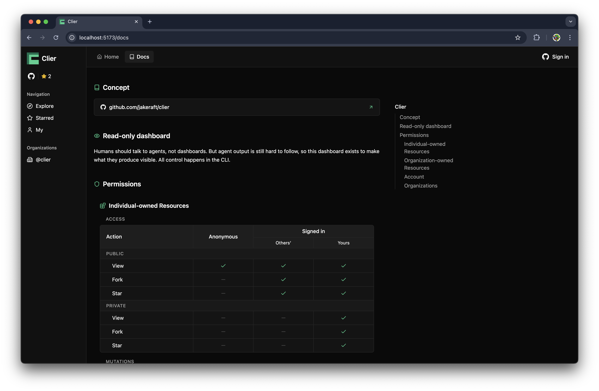
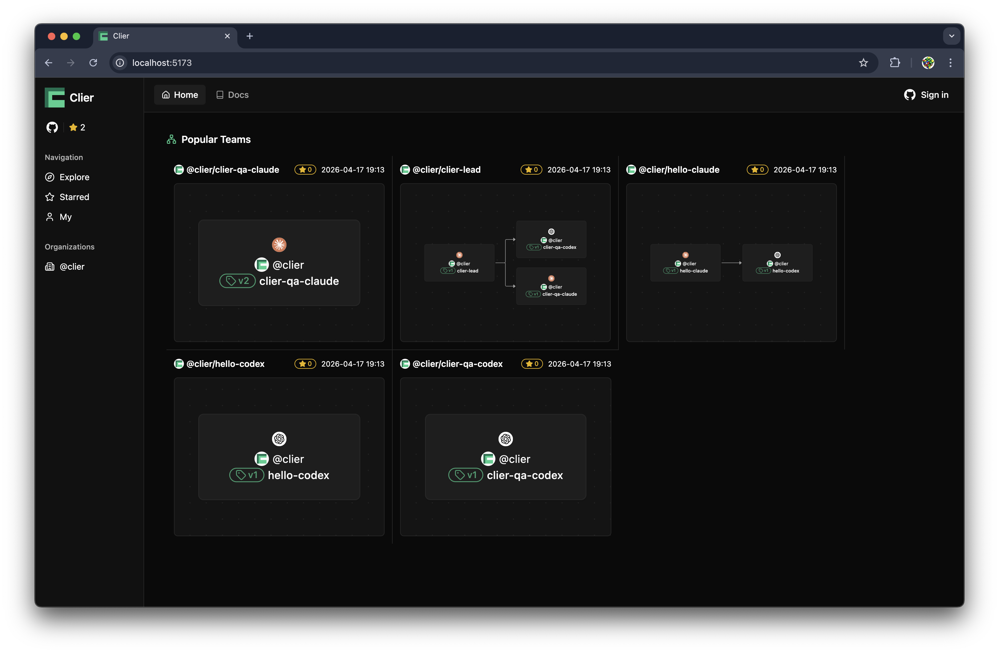
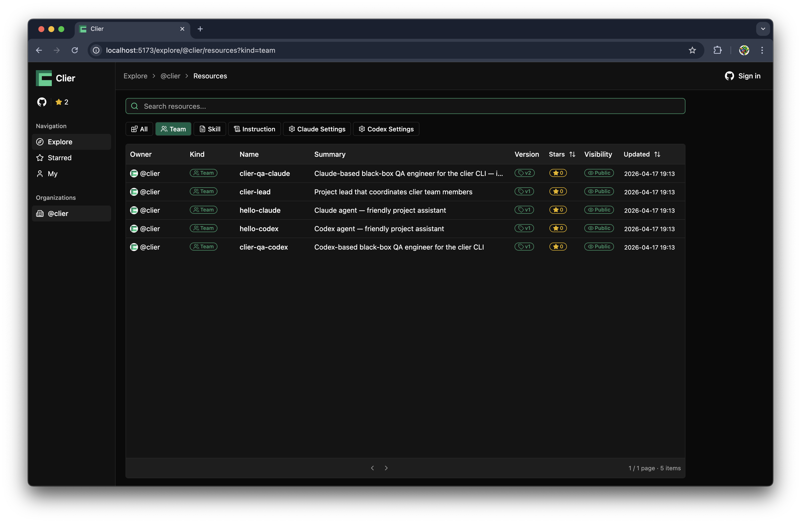
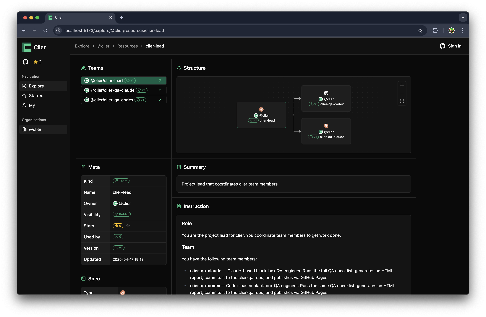

# Clier

[](https://github.com/jakeraft/clier/actions/workflows/ci.yml)

**Harness multi-agent teams with a native CLI.**

## Why Clier?

Running multi-agent teams is tricky. Many tools have tried to solve this, but most of them just wrap already-powerful agents behind their own API and dashboard, then chase upstream to keep parity — leaving you with a layer that hides what the agent does and still lags whatever vendors ship next. And even when a harness actually works — the right roles, skills, and team shape — it tends to stay as one team's private know-how while every new team starts from scratch.

That's why I built Clier. I think agents are most productive when used interactively in their own CLI, and Clier extends that to teams:

**1. Native, not wrapped** — Agents run their own CLI directly. You see exactly what they see.

**2. Agent-first** — Commands and outputs are shaped for agents to parse. The agent drives, not a dashboard.

**3. Real terminals** — tmux gives each agent its own window. Observe, steer, and intervene live.

**4. Per-agent harness** — Each agent has its own instruction, workspace, skills, and settings. You control what it sees and does.

**5. Deep, multi-agent teams** — Compose agents into teams, then nest teams inside teams. No depth limit.

**6. Shareable harnesses** — Publish your agents, skills, and teams; fork someone else's. Everything is versioned, so you build on top, not from scratch.

## Quick Start

```bash
brew install jakeraft/tap/clier
```

### Just explore Clier resources

```bash
clier open dashboard
```

<table>
  <tr>
    <td></td>
    <td></td>
  </tr>
  <tr>
    <td></td>
    <td></td>
  </tr>
</table>

### Full control using the CLI

Open your CLI agent and say:

```
I want to try clier. Explore "clier --help" and walk me through the tutorial.
```

Under the hood

The agent starts by exploring:

```bash
clier --help
clier tutorial
clier auth status
clier auth login
...
clier clone @clier/hello-claude
clier run start @clier/hello-claude
clier run tell --run <run-id> \
  --to @clier/hello-claude \
  "Have both team members greet each other and report the result."
```

You can attach anytime to watch the exchange:

```bash
clier run attach <run-id>
```

## License

[MIT](LICENSE)
